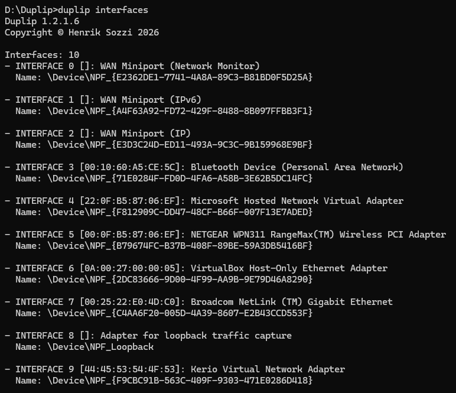
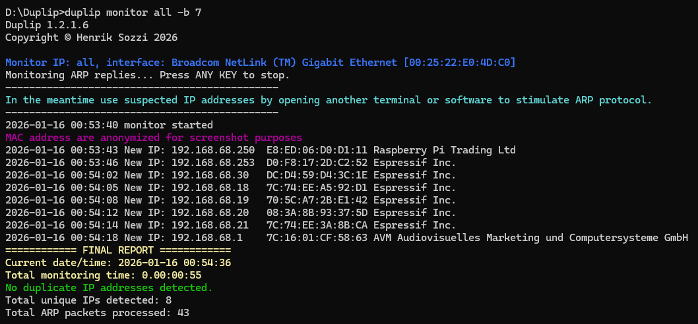
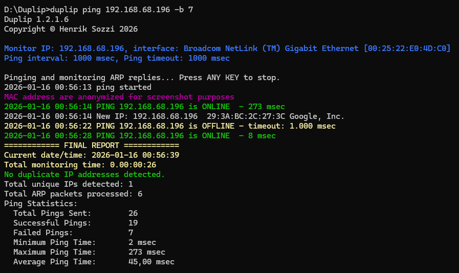
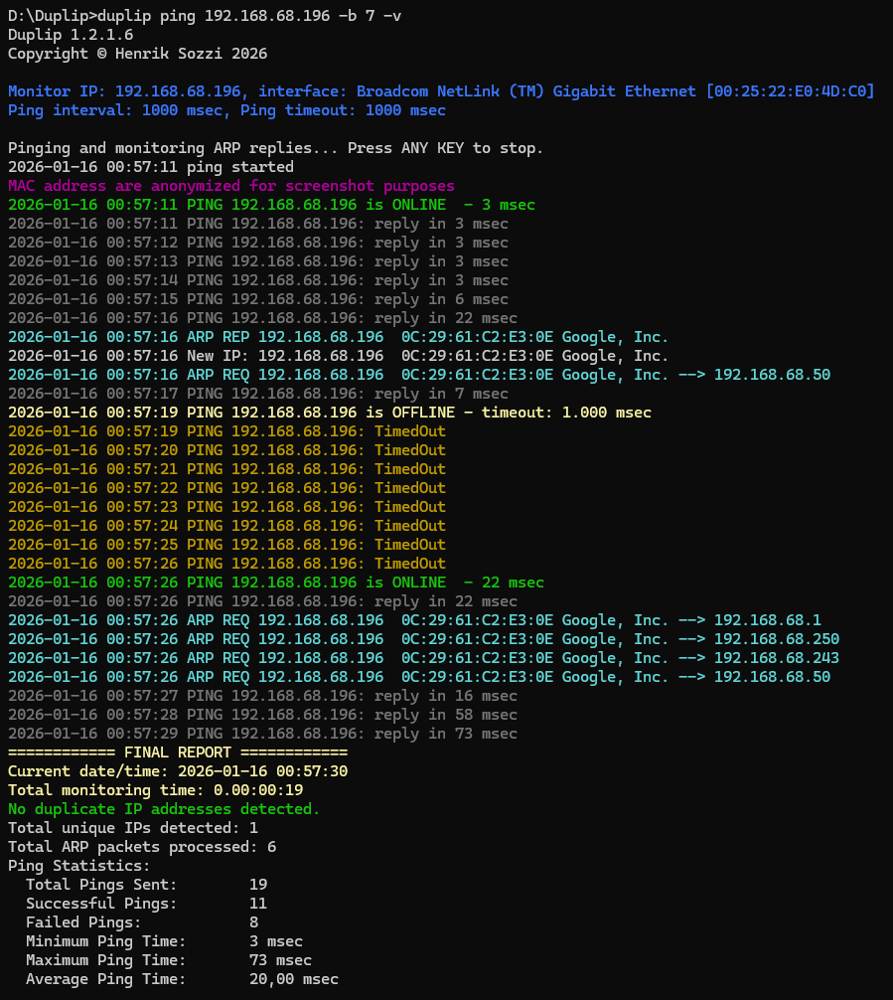
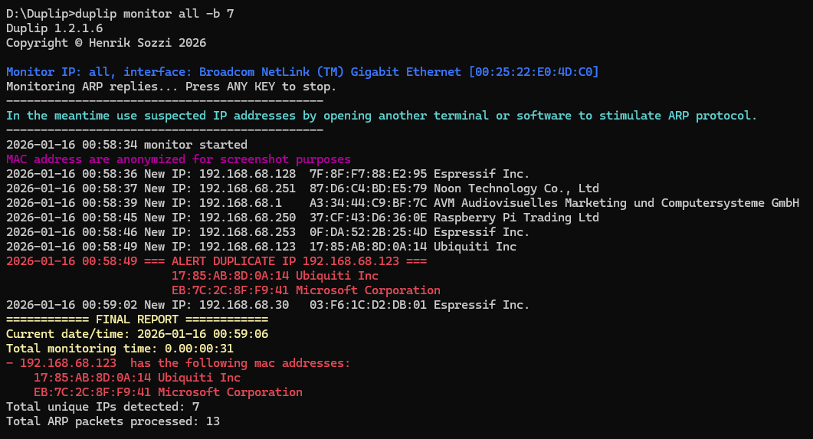

[](https://github.com/energywave/duplip/releases/latest)

# Duplip

**Duplip** is a command-line tool for detecting **duplicate IP addresses** on a local subnet by capturing and analyzing ARP packets (via Npcap) to identify multiple MAC addresses responding to the same IP.

---

## Features

- Scan a **specific IP** or the **whole subnet** to detect duplicates in real-time
- Analyze **ARP** packets to identify multiple MAC addresses for the same IP
- Detect **ARP Request**, **ARP Reply** and **Gratuitous ARP** for network diagnostics
- No network traffic, duplip listen to incoming ARP packets (*except if you select to ping*)
- Lightweight console output suitable for interactive use and scripting
- Timestamp with every event and log to file to keep history
- Windows standalone installer with optional PATH integration for a super easy setup

---

## Requirements

- **Operating System**: Windows 7 to Windows 11, Windows Server 2008 R2 to Windows Server 2025 (x86 and x64)
- **Packet Capture Library**: [Npcap](https://npcap.com/#download)
- **.NET Runtime**: .NET Framework 4.8

---

## Installation

### Option 1 – Installer (Recommended)

1. Download the latest release from:  
   [https://github.com/energywave/duplip/releases](https://github.com/energywave/duplip/releases)
2. Run the setup (`DuplipSetup a.b.c.d.exe`)
3. (Optional) Check **"Add Duplip to PATH"** during installation
4. The installer will check that [Npcap](https://npcap.com/) is installed and, if needed, opens the webpage for you

### Option 2 – Portable Binary

1. Download the ZIP archive from the releases page
2. Extract to your preferred location
3. (Optional) Add the folder to your system `PATH` manually
4. Ensure [Npcap](https://npcap.com/) is installed on your system

---

## Quick Start

**Here are some basic usage examples**

First of all list available network interfaces:

```batchfile
duplip interfaces
```



Select the network interface you want to use and remember it by index, MAC address or name for later

Monitor in the whole subnet for IP duplicates:

```batchfile
duplip monitor all -b 7
```



Or continuosly ping an IP address monitoring it for duplicates:

```batchfile
duplip ping 192.168.68.196 -b 7
```



You can even show more data with the verbose option:

```batchfile
duplip ping 192.168.68.196 -b 7 -v
```


If it find some duplicate devices sharing the same IP you'll see something like this:



For a list of available verbs:

```batchfile
duplip --help
```
For a complete list of a verb options (monitor, for example):

```batchfile
duplip --help monitor
```


## How It Works

Duplip captures all incoming ARP packets on the selected network interface.

It can even ping a suspected duplicate IP address to check anomalies and IP duplication.

Maintains a map of IP → {MAC1, MAC2, ...}

If multiple distinct MAC addresses advertises as the same IP, it reports a duplicate

With `-v` or `--verbose` option, all ARP packets are logged to assist with network diagnostics

Built with [SharpPcap](https://github.com/dotpcap/sharppcap) and [PacketDotNet](https://github.com/dotpcap/packetnet) for packet capture and parsing.

### How It Really Works

In TCP/IP local network (ethernet or wifi, they works the same) all devices has a unique in the world address that is defined by the manufacturer. That is the MAC address and it's composed by 6 bytes. The most common way to represent is like that: 00:15:5D:31:B7:00.

Then we have IP addresses that can be automatically assigned by the DHCP server or set in the device as a static IP address, but that's on a higher level in the network stack.

In fact two devices that wants to communicate with each other on the local subnet have to know the other device MAC address to send packets to it.

This is where it comes the ARP table. Each device keep a local ARP table where it translates IP addresses with they associated MAC address.

To maintain that ARP table the operating system use the ARP protocol where a device can broadcast (ask to all devices on the subnet) "hey, I'm searching for the device with IP 192.168.0.100, who owns it?".

All devices in the local network will receive that packet but only the device wich has the requested IP will reply back to the sender "here I am! I have your requested IP and my MAC address is the following"

As the time to live in the ARP table is quite low (generally not more than a minute) the network is full of ARP packets that are asking and replying, plus some gratuitous ARP that will tell all devices "hey, I'm telling to all of you: I have this IP address and this MAC address, please note it".

Duplip is leveraging this mechanism to fastly detect duplicate IPs on the local subnet, by capturing all the ARP packets of all types and maintaining a list IP-MACs, detecting when more devices share the same IP.

## Roadmap

* Implement an internal MAC vendor OUI downloader / searcher
* Convert to a .net 10 project
* Cross-platform support (Linux/macOS) with libpcap
* Transform the engine to a portable library
* GUI for Windows/Linux/MacOS
* Multi-IP or IP range scanning
* Export results to JSON/CSV
* Integration with alerting systems (webhook, Telegram, email)

Contributions and feature suggestions are welcome via Issues and Pull Requests!

## Contributing
Contributions are welcome! You can help by:

* Reporting bugs
* Suggesting new features
* Submitting code improvements or refactorings
* Improving documentation

### Contributor License Agreement (CLA)
Before your first Pull Request can be merged, you must sign the Duplip Contributor License Agreement (CLA).

* The CLA text is available [here](https://gist.github.com/energywave/25d16302a4f6da24904fd28a93914a7e).
* Signing is automated via CLA Assistant bot on Pull Requests

### Why a CLA?

* Protects both contributors and the project legally
* Allows Duplip to remain open source (GPL-3.0) for the community
* Enables future dual licensing (e.g., GPL + commercial license) without retroactive consent issues
* Standard practice used by Apache, Linux Foundation, Google, and many open source projects

### By signing, you confirm that:

* Your contributions are your original work or you have permission to submit them
* Henrik Sozzi may license the project under GPL-3.0 and/or commercial proprietary licenses

## License
Duplip is licensed under the GNU General Public License v3.0 (GPL-3.0).

In brief:

✅ You can use, study, modify, and redistribute Duplip

✅ Derivative works must be distributed under GPL-3.0 with source code available

❌ Proprietary closed-source integration requires a separate commercial license

Full license text: [LICENSE](LICENSE)

For **commercial licensing** or **proprietary integration** inquiries, contact:
**Henrik Sozzi** – henrik.sozzi@gmail.com

## Author & Contact
Maintainer: Henrik Sozzi

Email: henrik.sozzi@gmail.com

Issues: https://github.com/energywave/duplip/issues

License: GPL-3.0 (see [LICENSE](LICENSE))

## Acknowledgments
Built with [SharpPcap](https://github.com/dotpcap/sharppcap), [PacketDotNet](https://github.com/dotpcap/packetnet) and [MacAddressVendorLookup](https://github.com/PingmanTools/MacAddressVendorLookup/)

Packet capture powered by [Npcap](https://npcap.com/)

Installer created with [Inno Setup](https://jrsoftware.org/)
